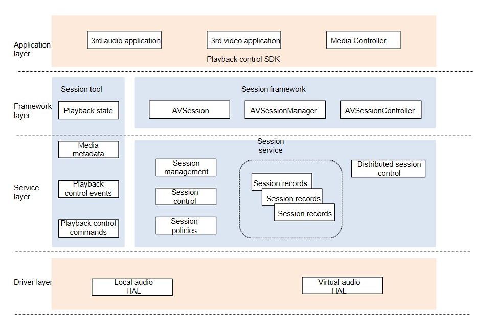

# AVSession Component

## Introduction

The AVSession component provides unified media control capabilities for the system. It enables users to use the system's Media Controller to control the playback behavior of third-party media applications on the local and remote devices and view related playback information.

#### Architecture Objective

The AVSession component aims to provide unified local and distributed media playback control capabilities and experience.

The component uses a global playback control entry to fully present media information and distributed media device information, so users can operate remote media as they operate local media.

The component provides simplified JS APIs for developers to quickly build media applications and easily access Media Controller to use distributed playback control capabilities.

## Logical Architecture



Data and command interaction between applications and AVSessionService are carried in media sessions. Applications store information in AVSessionService through sessions. AVSessionService receives control commands from system applications or external systems and forwards them to the applications, which then provide the functions as instructed.

- AVSession: An audio and video application applies for a session from AVSessionManager. It is then bound to the session. Through this session, the application and system exchange data and control commands. If an application does not apply for a session, it cannot run in the background.

- AVSessionController: Media Controller applies for a controller from AVSessionManager. Through this controller, Media Controller controls the session, thereby controlling application behavior.

- Distributed session control: After a local session is created, it is synchronized to a remote device, and a remote session is created. The remote session is controlled by sending control commands to the remote device's AVSessionService through its AVSessionController.

## Directory Structure

The structure of the repository directory is as follows:

```
/foundation/multimedia/avsession # Service code of the AVSession component
├── frameworks                             # Framework code
│   ├── common                             # Common framework code
│   ├── js                                 # JS framework implementation
│   └── native                             # Native framework implementation
├── interfaces                             # External APIs
│   ├── inner_api                          # Native external API files
│   └── kits                               # External JS API files
├── sa_profile
├── services                               # Service implementation
│   ├── etc
│   └── session
│       ├── adapter                        # External dependency adaptation
│       ├── ipc                            # IPC implementation
│       └── server                         # Service code implementation
│           └── remote                     # Distributed service implementation
├── utils                                  # Public library
└── bundle.json                            # Compilation file
```


## Repositories Involved

Media repository: multimedia/av_session
