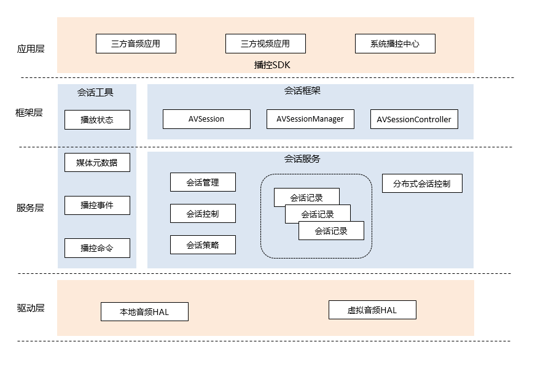

# AVSession部件<a name="ZH-CN_TOPIC_0000001148809513"></a>

- [AVSession部件<a name="ZH-CN_TOPIC_0000001148809513"></a>](#avsession部件)
  - [简介<a name="section1158716411637"></a>](#简介)
      - [架构目标<a name="avsession_targets"></a>](#架构目标)
  - [逻辑架构<a name="avsession_arch"></a>](#逻辑架构)
  - [目录结构<a name="section161941989596"></a>](#目录结构)
  - [相关仓<a name="section1533973044317"></a>](#相关仓)

## 简介<a name="section1158716411637"></a>

AVSession部件为系统提供了统一的媒体控制能力，当三方应用在OpenHarmony系统上运行时，用户可以通过系统播控中心对本端和组网内的远端音视频应用的播放行为进行控制，展示相关播放信息。

#### 架构目标<a name="avsession_targets"></a>

构建统一的本地和分布式的媒体播控能力及体验，包括：

1、面向用户：提供便捷的全局播控入口，将媒体信息充分展示给用户。同时自动展示分布式媒体设备信息，用户操作远端媒体如同操作本地媒体一样的体验。

2、面向开发者：向开发者提供精简的JS接口，帮助开发者快速构建媒体应用，并且能够方便的接入系统的播控中心，使用分布式播控能力。

## 逻辑架构<a name="avsession_arch"></a>



媒体会话承载应用与系统服务间的数据和命令交互功能，应用通过会话将信息保存在系统服务内，系统服务接收系统应用或者外部的控制命令，并转发到应用端，由应用实现对应的功能。

会话：音视频应用向控制中心申请会话，会话与应用绑定。应用通过会话向系统传递信息，系统通过会话向应用传递控制命令，如果应用不申请会话，则无法在后台运行。

控制器：系统播控中心向会话控制中心申请控制器，播控中心通过控制器可以控制指定的会话，进而控制应用行为。

分布式会话控制：组网内的设备创建本地会话后，本地会话会同步到远端，生成远端会话，并支持远端控制。需要控制远端会话时，通过远端控制器将控制命令发送到远端会话控制中心。

## 目录结构<a name="section161941989596"></a>

仓目录结构如下：

```
/foundation/multimedia/avsession  # 会话部件业务代码
├── frameworks                             # 框架代码
│   ├── common                             # 框架公共代码
│   ├── js                                 # js框架实现
│   └── native                             # native框架实现
├── interfaces                             # 外部接口层
│   ├── inner_api                          # native外部接口文件
│   └── kits                               # js外部接口文件
├── sa_profile
├── services                               # 服务实现
│   ├── etc
│   └── session
│       ├── adapter                        # 外部依赖适配
│       ├── ipc                            # ipc通信实现
│       └── server                         # 服务端代码实现
│           └── remote                     # 分布式服务实现
├── utils                                  # 会话部件公共库
└── bundle.json                            # 编译文件
```


## 相关仓<a name="section1533973044317"></a>

媒体组件仓：multimedia/av_session

