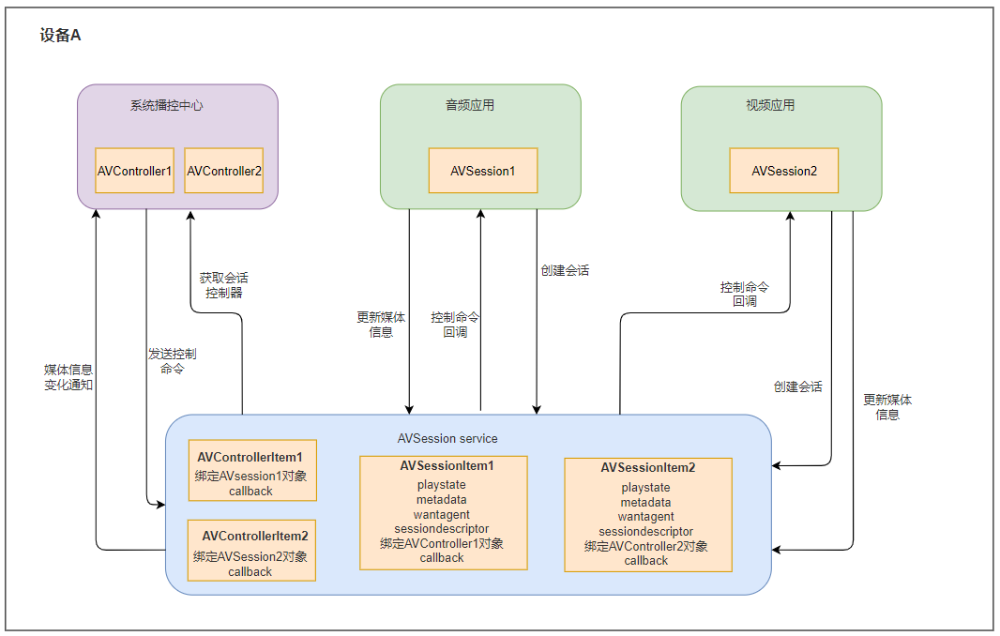

# 媒体会话管理

## 简介

AVSession（Audio & Video Session，媒体会话管理）提供媒体播控相关功能的接口，目的是提供系统内媒体的统一控制能力，三方音视频应用运行在openharmony系统上时，用户可以通过系统播控中心对本端的音视频应用的播放行为进行控制，展示播放信息。

通过AVSession播控框架，可以完成以下场景开发。

- **普通音频类应用**：接入AVSession播控框架后，用户无需点入具体应用界面，即可通过播控中心来控制该应用音频的播放，包括：播放、暂停、切换歌曲、调节音量等。
- **系统播控中心应用**：可以创建系统的播控中心应用，当开启了多个音频类应用时，用户可以通过系统播控中心统一管理。

## 基本概念

- 媒体会话

  三方应用端与系统服务端的交互通道，接收服务端控制命令回调给三方应用，三方应用设置会话状态（激活/去激活），播放状态，会话属性，会话元数据以及会话元数据等都是通过媒体会话对象来操作的。

- 控制器

  播控中心系统应用与系统服务端的交互通道，用于统一管理展示接入AVSession的音频应用的播放控制，支持获取三方应用的播放信息，发送播放控制命令，也支持监听三方应用的播放状态等的变化，确保信息的同步和更新

- 服务端
  
  作为常驻后台的进程，对所有媒体会话对象和控制器对象进行统一管理，支持创建媒体会话对象和控制器对象，支持查询系统内的所有会话信息，支持注册全局会话变更监听，监听全局会话的变化情况，同时支持分发系统媒体按键信息以及系统会话控制命令给焦点会话

## 运作机制

该模块提供了`AVSession`会话类和`AVSessionController`控制器类。

**图1** AVSession交互图



音频应用创建`AVSession`对象，并设置会话信息（包括媒体元数据、对应拉起的Ability、播放状态等）。

播控中心创建`AVSessionController`，并获取会话相关信息，向音频应用发送命令。

音频应用响应播控中心的命令并调整播放状态。

## 约束和限制

- 普通应用不支持开发播控中心端。当普通音视频应用运行在OpenHarmony上时，默认控制端为系统应用播控中心，开发者无需做额外的操作。***（到时候建链到播控中心，3.2会落）***
- **播控中心**为系统应用，当开发者需要基于OpenHarmony开发自己的系统时，可以开发本系统的播控中心应用。
- 为了解决音频在后台播放时用户无法获取到停止音频的入口，影响用户体验，AVSession服务增加了三方应用后台管控策略，只有三方应用接入了AVSession，才可以后台播放，否则当应用切后台时系统会强制暂停其音频播放。

## 开发指导

详细接口介绍请参考[API文档](../reference/apis/js-apis-avsession.md)。

### 普通音频类应用

1. 创建AVSession实例。
   ```js
   import avsession from '@ohos.multimedia.avsession';
   import WantAgent from '@ohos.wantAgent';
   import featureAbility from '@ohos.ability.featureAbility';

   //全局变量定义
   let mediaFavorite = false;
   let currentSession = null;
   let context = featureAbility.getContext();
   
   //创建音频类型会话
   avsession.createAVSession(context, "AudioAppSample", 'audio').then((session) => {
       currentSession = session;
       currentSession.activate();
   });
   ```

2. 管理AVSession会话信息，包括：
   - 设置会话元数据，除了媒体ID必选外，可选设置媒体标题、专辑信息、媒体作者、媒体时长、上一首/下一首媒体ID等。详细的会话元数据信息可参考API文档中的`AVMetadata`。
   - 设置启动Ability，通过`WantAgent`的接口实现。WantAgent一般用于封装行为意图信息，如果想要了解更多信息，可以查阅[WantAgent开发指导](../ability/wantagent.md)。
   - 设置播放状态。
   ```js
   //设置会话元数据
   let metadata  = {
       assetId: "121278",
       title: "lose yourself",
       artist: "Eminem",
       author: "ST",
       album: "Slim shady",
       writer: "ST",
       composer: "ST",
       duration: 2222,
       mediaImage: "https://www.example.com/example.jpg",    //请开发者根据实际情况使用
       subtitle: "8 Mile",
       description: "Rap",
       lyric: "https://https://www.example.com/example.lrc",    //请开发者根据实际情况使用
       previousAssetId: "121277",
       nextAssetId: "121279",
    };
   currentSession.setAVMetadata(metadata).then(() => {
       console.info('setAVMetadata successfully');
   }).catch((err) => {
       console.info('setAVMetadata : ERROR : '+ err.message);
   });
   
   //设置启动ability
   var wantAgentInfo = {
       wants: [
           {
               bundleName: "com.neu.setResultOnAbilityResultTest1",
               abilityName: "com.example.test.MainAbility",
           }
       ],
       operationType: WantAgent.OperationType.START_ABILITIES,
       requestCode: 0,
       wantAgentFlags:[WantAgent.WantAgentFlags.UPDATE_PRESENT_FLAG]
   }

   WantAgent.getWantAgent(wantAgentInfo).then((agent) => {
       currentSession.setLaunchAbility(agent).then(() => {
           console.info('setLaunchAbility successfully');
       }).catch((err) => {
           console.info('setLaunchAbility : ERROR : '+ err.message);
       });
   });
   
   //设置播放状态
   let PlaybackState = {
       state: avsession.PlaybackState.PLAYBACK_STATE_STOP,
       speed: 1.0,
       position:{elapsedTime: 0, updateTime: (new Date()).getTime()},
       bufferedTime: 1000,
       loopMode: avsession.LoopMode.LOOP_MODE_SEQUENCE,
       isFavorite: false,
   };
   currentSession.setAVPlaybackState(PlaybackState).then(() => {
       console.info('setAVPlaybackState successfully');
   }).catch((err) => {
       console.info('setAVPlaybackState : ERROR : '+ err.message);
   });
   
   //用户点击播放按键
   async function onPlay() {
       console.log("调用AudioPlayer.play方法");
       //设置播放状态
       await currentSession.setAVPlaybackState({state: avsession.PlaybackState.PLAYBACK_STATE_PLAY});
   }
   
   //用户点击暂停按键
   async function onPause() {
       console.log("调用AudioPlayer.pause方法");
       //设置播放状态
       await currentSession.setAVPlaybackState({state: avsession.PlaybackState.PLAYBACK_STATE_PAUSE});
   }
   ```

3. 响应播控中心控制行为。

   ```js
   currentSession.on('play', () => {
       console.log("调用AudioPlayer.play方法");
       //设置播放状态
       currentSession.setAVPlaybackState({state: avsession.PlaybackState.PLAYBACK_STATE_PLAY});
   });
   currentSession.on('pause', () => {
       console.log("调用AudioPlayer.pause方法");
       //设置播放状态
       currentSession.setAVPlaybackState({state: avsession.PlaybackState.PLAYBACK_STATE_PAUSE});
   });
   currentSession.on('stop', () => {
       console.log("调用AudioPlayer.stop方法");
       //设置播放状态
       currentSession.setAVPlaybackState({state: avsession.PlaybackState.PLAYBACK_STATE_STOP});
   });
   currentSession.on('playNext', () => {
       //如果媒体文件未准备好，则下载并缓存媒体文件，设置准备状态
       currentSession.setAVPlaybackState({state: avsession.PlaybackState.PLAYBACK_STATE_PREPARE});
       //成功获取媒体文件
       currentSession.setAVMetadata({assetId: '58970105', title: '不如我们明天见'});
       console.log("调用AudioPlayer.play方法");
       //设置播放状态
       let time = (new Data()).getTime();
       currentSession.setAVPlaybackState({state: avsession.PlaybackState.PLAYBACK_STATE_PLAY, position: {elapsedTime: 0, updateTime: time}, bufferedTime:2000});
   });
   currentSession.on('fastForward', () => {
       console.log("调用AudioPlayer的倍速播放");
       //设置播放状态
       currentSession.setAVPlaybackState({speed: 2.0});
   });
   currentSession.on('seek', (time) => {
       console.log("调用AudioPlayer的seek方法");
       //设置播放状态
       currentSession.setAVPlaybackState({position: {elapsedTime: time, updateTime: (new Data()).getTime()}});
   });
   currentSession.on('setSpeed', (speed) => {
       console.log("调用AudioPlayer的倍速播放" + speed);
       //设置播放状态
       currentSession.setAVPlaybackState({speed: speed});
   });
   currentSession.on('setLoopMode', (mode) => {
       console.log("应用自身切换循环模式" + mode);
       //设置播放状态
       currentSession.setAVPlaybackState({loopMode: mode});
   });
   currentSession.on('toggleFavorite', (assetId) => {
       console.log("应用保存当前assetId为喜爱" + assetId);
       //根据上一次的状态进行切换
       let favorite = mediaFavorite == false ? true : false;
       currentSession.setAVPlaybackState({isFavorite: favorite});
       mediaFavorite = favorite;
   });
   currentSession.on('handleKeyEvent', (event) => {
       console.log("用户按键" + event.keyCode);
   });
   
   currentSession.on('outputDeviceChanged', (device) => {
       console.log("输出设备变更,更新显示" + device.deviceName);
   });
   ```


4. 释放资源。

   ```js
   //取消注册回调
   currentSession.off('play');
   currentSession.off('pause');
   currentSession.off('stop');
   currentSession.off('playNext');
   currentSession.off('playPrevious');
   currentSession.off('fastForward');
   currentSession.off('rewind');
   currentSession.off('seek');
   currentSession.off('setSpeed');
   currentSession.off('setLoopMode');
   currentSession.off('toggleFavorite');
   currentSession.off('handleKeyEvent');
   currentSession.off('outputDeviceChanged');
   
   //去激活session并销毁对象
   currentSession.deactivate().then(() => {
       currentSession.destory();
   });
   ```

### 播控中心

1. 创建AVController实例。

   ```js
   import avsession from '@ohos.multimedia.avsession';
   import {Action KeyEvent} from '@ohos.multimodalInput.KeyEvent';
   import wantAgent from '@ohos.wantAgent';
   
   // 全局变量定义
   let g_controller = new Array<avsession.AVSessionController>();
   let g_centerSupportCmd:Set<avsession.AVControlCommandType> = new Set(['play', 'pause', 'playNext', 'playPrevious', 'fastForward', 'rewind', 'seek','setSpeed', 'setLoopMode', 'toggleFavorite']);
   let g_validCmd:Set<avsession.AVControlCommandType>;
   
   // 获取系统内 avsession 描述符.(先打开三方应用，三方应用会自己创建avsession)
   avsession.getAllSessionDescriptors().then((descriptors) => {
       descriptors.forEach((descriptor) => {
           avsession.createController(descriptor.sessionId).then(   
           (controller) => {
               g_controller.push(controller);
           }, err => {
               console.error('createController error');
           }
       })
   }, err => {
       console.error('getAllSessionDescriptors error');
   });
   
   //更新单个控制器卡片
   let controller = g_controller[0];
   if (controller != undefined) {
       //获取元数据显示到卡片
       controller.getAVMetadata().then((data) => {
           console.log("歌名" + data.title);
           console.log("歌手" + data.artist);
       });
       //获取播放状态更新按钮状态
       controller.getAVPlaybackState().then((state) => {
           console.log("播放状态" + state.state);
           console.log("当前播放速度" + state.speed);
       });
       //获取支持的命令
       controller.getValidCommands().then((cmds) => {
           for (let c of g_centerSupportCmd) {
               if (cmds.has(c)) {
                   g_validCmd.add(c);
               }
           }
       });
   }
   ```

2. 控制AVSession会话行为。

   ```js
   //用户点击播放按键:发送控制命令--播放
   if (g_validCmd.has('play')) {
       controller.sendControlCommand({command:'play'});
   }
   
   //用户点击循环模式:发送控制命令--单曲循环
   if (g_validCmd.has('setLoopMode')) {
       controller.sendControlCommand({command: 'setLoopMode', parameter: avsession.LoopMode.LOOP_MODE_SINGLE});
   }
   
   //发送按键事件
   let keyItem = {code: 0x49, pressedTime: 123456789, deviceId: 0};
   let event = {action: 2, key: keyItem, keys: [keyItem]};
   controller.sendAVKeyEvent(event).then(() => {
       console.info('sendAVKeyEvent Successfully');
   }).catch((err) => {
       console.info('sendAVKeyEvent : ERROR : '+ err.message);
   });
   
   //用户点击卡片空白位置拉起应用
   controller.getLaunchAbility().then((want) => {
       console.log("前台拉起应用");
   }).catch((err) => {
       console.info('getLaunchAbility : ERROR : '+ err.message);
   });
   
   //发送系统媒体按键事件
   let keyItem = {code: 0x49, pressedTime: 123456789, deviceId: 0};
   let event = {action: 2, key: keyItem, keys: [keyItem]};
   avsession.sendSystemAVKeyEvent(event).then(() => {
       console.info('sendSystemAVKeyEvent Successfully');
   }).catch((err) => {
       console.info('sendSystemAVKeyEvent : ERROR : '+ err.message);
   });
   
   //发送系统控制命令，系统会把控制命令发送到Top会话中
   let avcommand = {command: 'toggleFavorite', parameter: "false"};
   avsession.sendSystemControlCommand(avcommand).then(() => {
       console.info('sendSystemControlCommand successfully');
   }).catch((err) => {
       console.info('sendSystemControlCommand : ERROR : '+ err.message);
   });
   ```

3. 同步AVSession会话信息，监听AVSession服务以及AVSession会话状态。

   ```js
   //注册元数据更新监听
   let filterKeys = new Set<keyof avsession.AVMetadata>();
   filterKeys.add("assetId");
   filterKeys.add("title");
   filterKeys.add("description");
   controller.on('metadataChanged', filterKeys, (metadata) => {
       console.info('on metadataChanged assetId : ' + metadata.assetId);
   });
   
   //注册播放状态更新监听
   let filterKeys = new Set<keyof avsession.AVPlaybackState>();
   filterKeys.add("state");
   filterKeys.add("speed");
   filterKeys.add("loopMode");
   controller.on('AVPlaybackState', filterKeys, (playbackState) => {
       console.info('on AVPlaybackState state : ' + playbackState.state);
   });
   
   //注册会话支持的命令变更监听
   controller.on('validCommandChanged', (cmds) => {
       console.info('validCommandChanged : SUCCESS : size : ' + cmds.size);
       console.info('validCommandChanged : SUCCESS : cmds : ' + cmds.values());
       g_validCmd.clear();
       for (let c of g_centerSupportCmd) {
           if (cmds.has(c)) {
               g_validCmd.add(c);
           }
       }
   });
   
   //注册输出设备变更监听
   controller.on('outputDeviceChanged', (device) => {
       console.info('on outputDeviceChanged device isRemote : ' + device.isRemote);
   });
   
   //注册当前会话销毁监听
   controller.on('sessionDestroyed', () => {
       console.info('on sessionDestroyed : SUCCESS ');
       controller.destroy();
   });
   
   //注册会话激活状态变更监听
   controller.on('activeStateChanged', (isActive) => {
       if (isActive) {
           console.log("控制器卡片按键高亮");
       } else {
           console.log("控制器卡片按键变更为无效");
       }
   });
   
   //监听系统会话创建
   avsession.on('sessionCreated', (session) => {
       //新增会话，需要创建控制器
       avsession.createController(session.sessionId).then((controller) => {
           g_controller.push(controller);
       });
   });
   
   //监听系统会话销毁
   avsession.on('sessionDestroyed', (session) => {
       let index = g_controller.findIndex((controller) => {
           return controller.sessionId == session.sessionId;
       });
       if (index != 0) {
           g_controller[index].destroy();
            g_controller.splice(index, 1);
       }
   });
   
   //监听系统最高优先级会话变更
   avsession.on('topSessionChanged', (session) => {
       let index = g_controller.findIndex((controller) => {
           return controller.sessionId == session.sessionId;
       });
       //将该会话显示排到第一个
       if (index != 0) {
           g_controller.sort((a, b) => {
               return a.sessionId == session.sessionId ? -1 : 0;
           });
       }
   });
   
   //监听服务异常
   avsession.on('sessionServiceDied', () => {
       //服务端异常，应用清理资源
       console.log("服务端异常");
   }
   ```

4. 释放资源。

   ```js
   //取消注册回调
   controller.off('metadataChanged');
   controller.off('playbackStateChanged');
   controller.off('sessionDestroyed');
   controller.off('activeStateChanged');
   controller.off('validCommandChanged');
   controller.off('outputDeviceChanged');
   
   //销毁controller对象
   controller.destroy();
   ```

